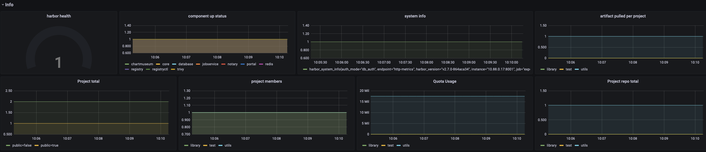
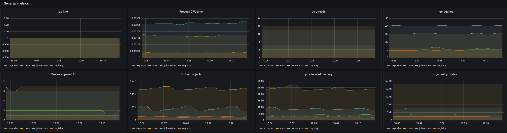
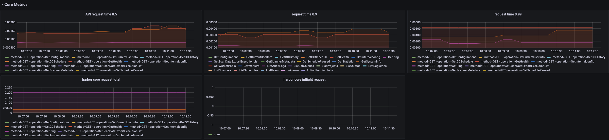
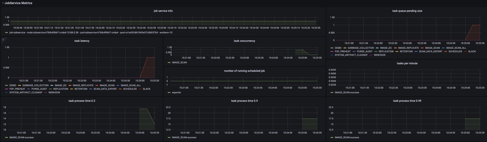
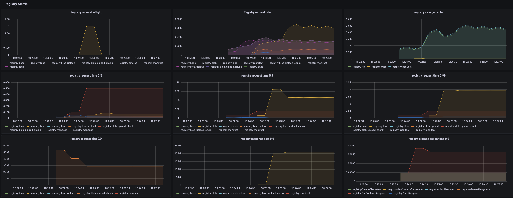

<h1 align="center">
<picture>
  <source media="(prefers-color-scheme: dark)" srcset="https://raw.githubusercontent.com/sighupio/distribution/refs/heads/main/docs/assets/white-logo.png">
  <source media="(prefers-color-scheme: light)" srcset="https://raw.githubusercontent.com/sighupio/distribution/refs/heads/main/docs/assets/black-logo.png">
  
</picture><br/>
  Registry Add-On Module
</h1>


<!-- <SD-DOCS> -->

**Registry Add-On Module** provides all components necessary to deploy a container registry on top of Kubernetes based on the [Harbor project][harbor-site] for the [SIGHUP Distribution (SD)][kfd-repo].

If you are new to SD please refer to the [official documentation][sd-docs] on how to get started with SD.

## Packages

Registry Add-On Module provides the following packages:

| Package                  | Version  | Description                                                                                                                                                          |
| ------------------------ | -------- | -------------------------------------------------------------------------------------------------------------------------------------------------------------------- |
| [Harbor](katalog/harbor) | `v2.9.5` | Harbor is an open-source container image registry that secures images with role-based access control, scans images for vulnerabilities, and signs images as trusted. |

Click on each package to see its full documentation.

## Compatibility

| Kubernetes Version |   Compatibility    | Notes                                               |
| ------------------ | :----------------: | --------------------------------------------------- |
| `1.28.x`           | :white_check_mark: | Conformance tests passed.                           |
| `1.29.x`           | :white_check_mark: | Conformance tests passed.                           |
| `1.30.x`           | :white_check_mark: | Conformance tests passed.                           |
| `1.31.x`           | :white_check_mark: | Conformance tests passed.                           |
| `1.32.x`           | :white_check_mark: | Conformance tests passed.                           |

The table shows the latest 5 compatible versions. Check the [compatibility matrix][compatibility-matrix] for the complete list of all supported versions.

## Usage

### Prerequisites

| Tool                        | Version    | Description                                                                                                                                                    |
| --------------------------- | ---------- | -------------------------------------------------------------------------------------------------------------------------------------------------------------- |
| [furyctl][furyctl-repo]     | `>=0.6.0`  | The recommended tool to download and manage SD modules and their packages. To learn more about `furyctl` read the [official documentation][furyctl-repo].     |
| [kustomize][kustomize-repo] | `>=5.6.0` | Packages are customized using `kustomize`. To learn how to create your customization layer with `kustomize`, please refer to the [repository][kustomize-repo]. |

All packages in this repository have the following dependencies, for package specific dependencies, please visit the single package's documentation:

### Deployment

1. List the packages you want to deploy and their version in a `Furyfile.yml`

```yaml
bases:
  - name: registry/harbor
    version: "v3.2.0"
```

> See `furyctl` [documentation][furyctl-repo] for additional details about `Furyfile.yml` format.

2. Execute `furyctl vendor -H` to download the packages

3. Inspect the download packages under `./vendor/katalog/registry/harbor`.

4. Define a `kustomization.yaml` that includes the `./vendor/katalog/registry/harbor` directory as resource.

```yaml
resources:
- ./vendor/katalog/registry/harbor
```

5. Apply the necessary patches. You can see some examples in the [examples directory](examples/).

6. To deploy the packages to your cluster, execute:

```bash
kustomize build . | kubectl apply -f -
```

### Monitoring

The Registry Module also includes metrics and dashboards for Harbor's components.

You can monitor the status of Harbor from the provided Grafana Dashboards. Here are some screenshots:

<!-- markdownlint-disable MD033 -->
<a href="docs/images/screenshots/harbor-general-info.png"></a>
<a href="docs/images/screenshots/harbor-general-metrics.png"></a>
<a href="docs/images/screenshots/harbor-core-metrics.png"></a>
<a href="docs/images/screenshots/harbor-jobservice-metrics.png"></a>
<a href="docs/images/screenshots/harbor-registry-metrics.png"></a>
<!-- markdownlint-enable MD033 -->

> click on each screenshot for the full screen version

The following set of alerts is included:

| Alert Name                         | Summary                                                                                                                                             | Description                                                                                     |
| ---------------------------------- | --------------------------------------------------------------------------------------------------------------------------------------------------- | ----------------------------------------------------------------------------------------------- |
| HarborIsDown                       | The service of Harbor is Down                                                                                                                       | [Critical]: Check the deployment of Harbor and all components as they may be down               |

### Examples

To see examples on how to customize Registry Add-On Module, please view the [examples](examples) directory.

<!-- Links -->
[harbor-site]: https://goharbor.io/
[kfd-monitoring]: https://github.com/sighupio/fury-kubernetes-monitoring
[furyctl-repo]: https://github.com/sighupio/furyctl
[sighup-page]: https://sighup.io
[kfd-repo]: https://github.com/sighupio/fury-distribution
[kustomize-repo]: https://github.com/kubernetes-sigs/kustomize
[sd-docs]: https://docs.kubernetesfury.com/docs/distribution/
[compatibility-matrix]: https://github.com/sighupio/add-on-registry/blob/master/docs/COMPATIBILITY_MATRIX.md

<!-- </SD-DOCS> -->

<!-- <FOOTER> -->

## Contributing

Before contributing, please read first the [Contributing Guidelines](docs/CONTRIBUTING.md).

### Reporting Issues

In case you experience any problem with the module, please [open a new issue](https://github.com/sighupio/add-on-registry/issues/new/choose).

## License

This module is open-source and it's released under the following [LICENSE](LICENSE)

<!-- </FOOTER> -->
