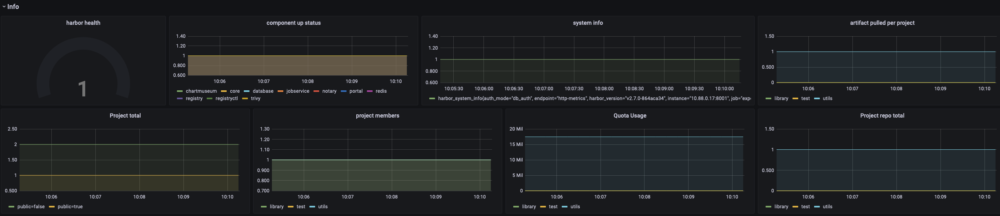
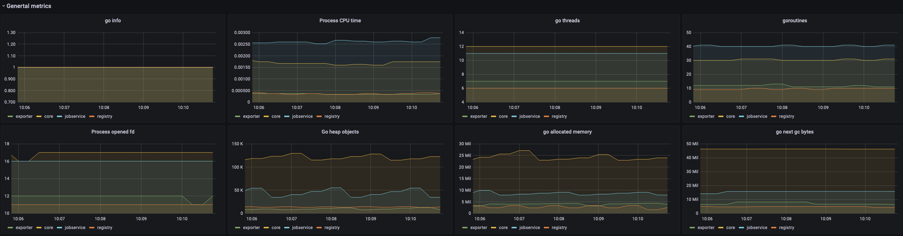
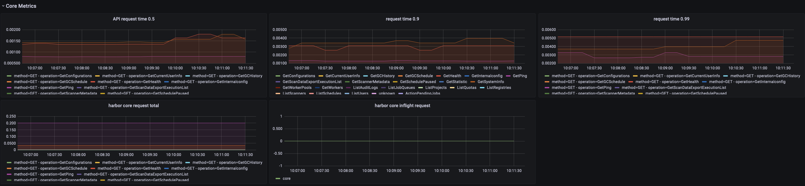
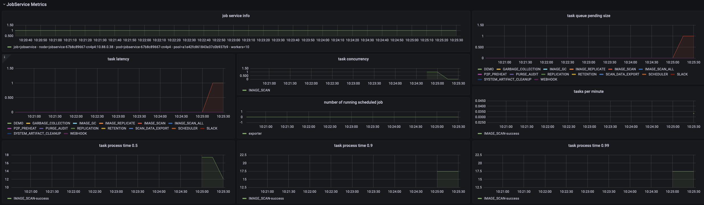
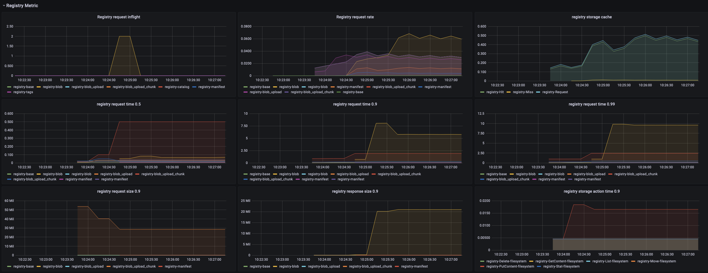

<h1 align="center">
<picture>
  <source media="(prefers-color-scheme: dark)" srcset="https://raw.githubusercontent.com/sighupio/distribution/refs/heads/main/docs/assets/white-logo.png">
  <source media="(prefers-color-scheme: light)" srcset="https://raw.githubusercontent.com/sighupio/distribution/refs/heads/main/docs/assets/black-logo.png">
  
</picture><br/>
  Registry Add-On Module
</h1>


<!-- <SD-DOCS> -->

**Registry Add-On Module** provides all components necessary to deploy a container registry on top of Kubernetes based on the [Harbor project][harbor-site] for the [SIGHUP Distribution (SD)][kfd-repo].

If you are new to SD please refer to the [official documentation][sd-docs] on how to get started with SD.

## Packages

Registry Add-On Module provides the following packages:

| Package                  | Version  | Description                                                                                                                                                          |
| ------------------------ | -------- | -------------------------------------------------------------------------------------------------------------------------------------------------------------------- |
| [Harbor](katalog/harbor) | `v2.11.2` | Harbor is an open-source container image registry that secures images with role-based access control, scans images for vulnerabilities, and signs images as trusted. |

Click on each package to see its full documentation.

## Compatibility

| Kubernetes Version |   Compatibility    | Notes                                               |
| ------------------ | :----------------: | --------------------------------------------------- |
| `1.29.x`           | :white_check_mark: | Conformance tests passed.                           |
| `1.30.x`           | :white_check_mark: | Conformance tests passed.                           |
| `1.31.x`           | :white_check_mark: | Conformance tests passed.                           |
| `1.32.x`           | :white_check_mark: | Conformance tests passed.                           |
| `1.33.x`           | :white_check_mark: | Conformance tests passed.                           |

The table shows the latest 5 compatible versions. Check the [compatibility matrix][compatibility-matrix] for the complete list of all supported versions.

## Usage

### Prerequisites

| Tool                        | Version   | Description                                                                                                                                                    |
| --------------------------- | --------- | -------------------------------------------------------------------------------------------------------------------------------------------------------------- |
| [kustomize][kustomize-repo] | `>=5.8.0` | Packages are customized using `kustomize`. To learn how to create your customization layer with `kustomize`, please refer to the [repository][kustomize-repo]. |

All packages in this repository have the following dependencies, for package specific dependencies, please visit the single package's documentation:

### Deployment

1. Download the Kustomize distribution that you want to install:

    ```bash
    ADD_ON_REGISTRY_DISTRIBUTION="full-harbor" # or "harbor-ha"
    ADD_ON_REGISTRY_VERSION=v3.4.0 # check the latest version
    kustomize localize "https://github.com/sighupio/add-on-registry//katalog/harbor/distributions/${ADD_ON_REGISTRY_DISTRIBUTION}?ref=${ADD_ON_REGISTRY_VERSION}" vendor
    ```

2. Inspect the download packages under `./vendor/katalog/registry/harbor`.

3. Define a `kustomization.yaml` that includes the `./vendor/katalog/registry/harbor/distributions/<your desired distribution>` directory as resource.

    ```yaml
    resources:
    - ./vendor/katalog/registry/harbor/distributions/<your desired distribution>
    ```

4. Apply the necessary patches. You can see some examples in the [examples directory](examples/).

5. To deploy the packages to your cluster, execute:

```bash
kustomize build . | kubectl apply -f -
```

### Upgrading

Always check the [Upgrade Guide](https://goharbor.io/docs/latest/administration/upgrade/) from Harbor. Make sure that the version you are currently running is compatible with the upgrade to the version you want to install.

The `Core` component of Harbor automatically runs the needed Database migrations, so normally it is sufficient to just deploy the new module version.

You can make sure that the migration runs on a single Pod by:

1. Scaling down to zero the existing `core` deployment: `kubectl scale deploy -n registry core --replicas 0`
2. Apply the new version, making sure that the `replicas` of the `core` deployment is set to `1`
3. When the migration is finished, you can set the desired number of replicas and apply again

> [!WARNING]
>
> *Always* backup your data before attempting an upgrade!

### Monitoring

The Registry Module also includes metrics and dashboards for Harbor's components.

You can monitor the status of Harbor from the provided Grafana Dashboards. Here are some screenshots:

<!-- markdownlint-disable MD033 -->
<a href="docs/images/screenshots/harbor-general-info.png"></a>
<a href="docs/images/screenshots/harbor-general-metrics.png"></a>
<a href="docs/images/screenshots/harbor-core-metrics.png"></a>
<a href="docs/images/screenshots/harbor-jobservice-metrics.png"></a>
<a href="docs/images/screenshots/harbor-registry-metrics.png"></a>
<!-- markdownlint-enable MD033 -->

> click on each screenshot for the full screen version

The following set of alerts is included:

| Alert Name                         | Summary                                                                                                                                             | Description                                                                                     |
| ---------------------------------- | --------------------------------------------------------------------------------------------------------------------------------------------------- | ----------------------------------------------------------------------------------------------- |
| HarborIsDown                       | The service of Harbor is Down                                                                                                                       | [Critical]: Check the deployment of Harbor and all components as they may be down               |

### Examples

You can check out the examples we prepared about customiizing the Registry Add-On Module:

| Example                               | Description                                                                                                |
| ------------------------------------- | ---------------------------------------------------------------------------------------------------------- |
| [full-harbor](./examples/full-harbor) | Full in-cluster Harbor Installation.                                                                       |
| [harbor-ha](./examples/harbor-ha)     | Full Harbor installation in HA, using external Database engine and Redis instances instead of the provided ones. |

If you need to migrate your deployment type from `full-harbor` to `harbor-ha`, you can read the [Harbor Full to HA Migration Guide](./docs/operations/full-to-ha-migration.md).

<!-- Links -->
[harbor-site]: https://goharbor.io/
[furyctl-repo]: https://github.com/sighupio/furyctl
[kfd-repo]: https://github.com/sighupio/distribution
[kustomize-repo]: https://github.com/kubernetes-sigs/kustomize
[sd-docs]: https://docs.kubernetesfury.com/docs/distribution/
[compatibility-matrix]: https://github.com/sighupio/add-on-registry/blob/master/docs/COMPATIBILITY_MATRIX.md

<!-- </SD-DOCS> -->

<!-- <FOOTER> -->

## Contributing

Before contributing, please read first the [Contributing Guidelines](docs/CONTRIBUTING.md).

### Reporting Issues

In case you experience any problem with the module, please [open a new issue](https://github.com/sighupio/add-on-registry/issues/new/choose).

## License

This module is open-source and it's released under the following [LICENSE](LICENSE)

<!-- </FOOTER> -->
